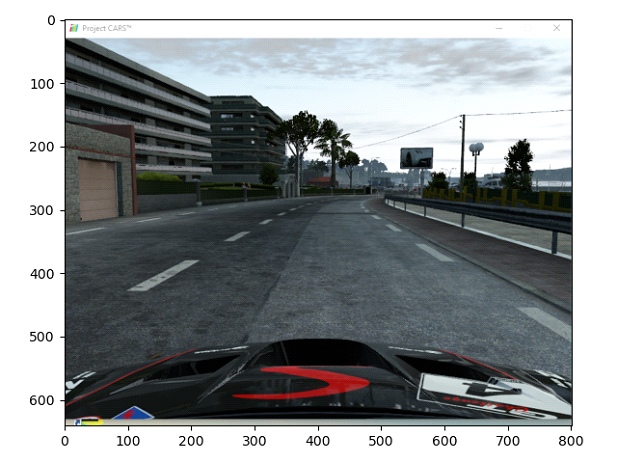
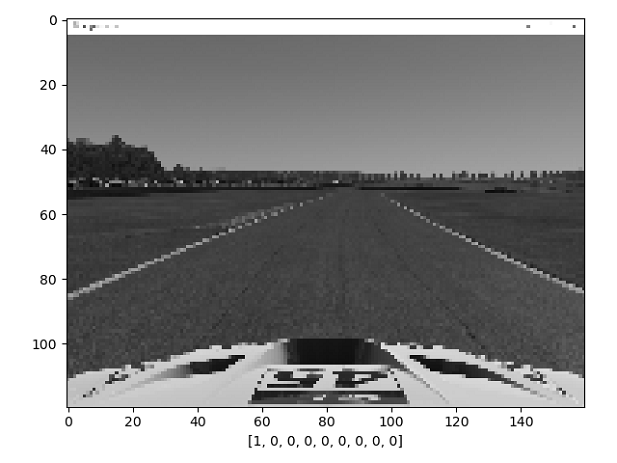
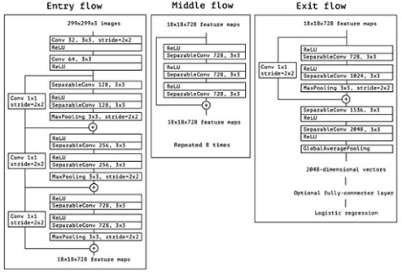
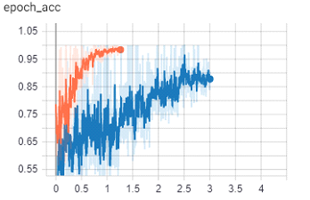

# Simulacija samovozećeg automobila pomoću neuronske mreže

## Kreiranje podataka za treniranje modela

Kada se govori o podacima za trening tada se misli o ulaznim podacima koji će služiti za „treniranje“ modela. 
Proces u kojem su se kreirali o ovom diplomskom radu će u sljedećim sekcijama biti detaljnije objašnjen.
Kako bi neki model mogao iz nekih podataka nešto naučiti, te podatke treba kreirati prema načinu kako bi taj model što korektnije mogao donositi odluke. 
Kako se radi o slikovnoj klasifikaciji, potrebne su slike. Slike u ovom slučaju su slike zaslona 
tj. simulacije automobila. Jedna takva slika je prikazana na slici ispod. 

 

 

Kako bi kreirali set podataka koji bi bio dovoljan da postanu trening podaci za model neuronske mreže oni 
moraju biti u što većem broju. Što više podataka to je model precizniji ali to nije uvijek skroz točno 
jer se radi i kvaliteti podataka. Ukoliko bi sakupili 10% od cijelog seta podataka nekvalitetne podatke tada 
bi se preciznost modela kompromitirala. U ovom diplomskom radu je korišteno za treniranje modela 
više do 100 000 različitih slika. U usporedbi s nekim od profesionalnijih modela ta je brojka vrlo mala. 
Kako sama slika kao ona prikazana na slici 48. nije dovoljna da model može sam odlučivati koje postupke donijeti, 
morali su se dodati još parametara a to su smjer skretanja u tom trenutku. 

 

 

Na slici iznad kod x-osi je prikaza niz brojeva. Takav niz brojeva označuje smjer u kojem je netko 
od strane igrača pritisnuo kako bi upravljao vozilom u simulaciji.

Radi se o izabranim slovima na tipkovnici koje korisnik tijekom igre pritisne. 
Ako se radilo npr. o tipki „W“ tada će se zapisati u varijablu wa da je korisnik pritisnuo tu tipku 
i vratiti tu vrijednost. Ta vrijednost će se zapisati u tzv. „one-hot“ polje i izgledat će kao „[1, 0, 0, 0, 0, 0, 0, 0]“. Prva vrijednost označava da je korisnik pritisnuo tipku „W“. 
Te se onda ta vrijednost pridružuje slici

## Treniranje modela

Treniranje modela je krucijalna stvar kod neuronskih mreža. Sve ovisi kakve će podatke imati na raspolaganju 
i kojim će načinom učiti iz ulaznih podataka. U radu je korišten Xception model. Xception model je 
već istrenirani model na temelju ImageNet baze podataka. ImageNet je projekt koji može istrenirati model, 
te klasificirati 1000 različitih kategorija objekta. Neke od kategorija su pasmine pasa, mačaka, riba 
i različitih automobilskih dijelova i mnogo više. Korišteno je za trening oko 1,2 milijun slika, 
za validaciju 50 000 i za testiranje 100 000. Xception model je ekstenzija modela arhitekture Inception. 

 

 

Na grafovima ispod možemo vidjeti plavom bojom (model George) i narančastom bojom (model Cosmo) 
kako su učili kroz vrijeme. Ako se bolje pogleda mogli bi reći da je model Cosmo precizniji od modela George. 
Ali na što treba pripaziti je to da model Cosmo pri kraju učenja doseže točnost od skoro 100%. 
Takva brojka nije realna u neuronskim mrežama te to znači da je došlo do zasićenja (eng. overfit). 
Tada model više ne zna sam odlučivati i moglo bi se reći da je sve ulazne podatke naučio na pamet i 
kada bi došao do podataka koji nisu bili u trening procesu, ne bi donosio precizne odluke. 
Zato je model George došao do realnog postotka preciznosti koji je iznosio oko 87%

 

 

## Testiranje modela

Testiranje samovozećeg automobila je odrađena u simulaciji Project Cars. 
Test prikazan na videu 1. je staza Nordschleife – Nürburgring. Staza je sama po sebi zahtjevna zbog velikog broja krivina. 
Model je bio učen na podacima koji su bili za postavljanje što boljeg vremena u jednom prijeđenom krugu staze. 
Zbog takvih podatak će i sama neuronska mreža voziti što brže je moguće. 

Mogli su se koristiti i podaci koji voze na sporijim brzinama što bi rezultiralo manjem griješenju modela. 
Još jedan način manjem griješenju modela jest bolja performansi računala na kojem se aplikacija izvodi zbog toga što bi se slike 
brže procesirale te bi bio brži odaziv neuronske mreže o donošenju odluke za koji se smjer kretanja odlučiti. 

## Zaključak

Korištenjem konvolucijske neuronske mreže se može postići samovozeće vozilo uz konstruktivno i kvalitetno 
postavljene ulazne podatke za treniranje modela. Model koji će imati najveći mogući postotak vjerojatnost točnosti. 
Kao što je prije spomenuto u razradi, rad se sastoji od dvije aplikacije za simulaciju samovozećeg vozila. 
Računalni vid bi mogao pomoći neuronskoj mreži pri odlukama koje nisu u većoj većini sigurne kod predikcije skretanja.
Nije implementirano da te dvije aplikacije (4.1. Računalni vid i 4.2. Model neuronske mreže „George“) rade u isto 
vrijeme i to je tehnički izvedivo ali bi došlo do kršenja kod aplikacija jer obje imaju prava kod upravljanja vozila.
Za rješavanje takve problematike bi bila potrebna implementacija integracijske aplikacije između dvije spomenute aplikacije kako bi se računalni vid mogao uključiti kada bi došlo do neodlučne predikcije. Za informacije kao što su trenutni kut vozila i mjerač brzine, koristio se API kreiran od strane developera igre Project Cars te iz API-a se izvlačili ti podaci. Unaprjeđenje modela je moguće uz parametrizaciju trenutne brzine vozila prilikom uzimanja zaslona i smjera. Tako da bi bio dodatan parametar trenutna brzina te bi s time dobili neuronsku mrežu koja je svjesna kojom se brzinom treba kretati u kojoj situaciji. Trenutno je to riješeno vrlo složenim rješenjem gdje se kreirala funkcija za takvu vrstu potrebe te ne daje neuronskoj mreži na slobodu o potpunom kretanju po stazi. Još jedna ideja je bila tipkovnicu zamijeniti igraćim volanom kako bi se dobio konkretniji smjer kretanja vozila te bi znatno olakšalo kretanje od strane neuronske mreže odnosno donošenju predikcije. Model može imati unaprjeđenja ali s trenutnim stanjem može odvoziti stazu Nordschleife – Nürburgring. Moguća su i nadograđivanja o detekciji objekata prilikom vožnje. Kod tog se podrazumijevaju prometni znakovi, pješaci, semafori i itd. Ali zbog tehničkih nedostatka jer takva aplikacija se treba izvoditi paralelno s pokretanjem neuronske mreže te bi došlo do manjka resursa prilikom izvođenja. 

 

## Dokumentacija:

### make_frames(), grab_screen()
https://stackoverflow.com/questions/35097837/capture-video-data-from-screen-in-python

### cv2.Gaussian Filtering
https://opencv-python-tutroals.readthedocs.io/en/latest/py_tutorials/py_imgproc/py_filtering/py_filtering.html

### cv2.Canny
https://opencv-python-tutroals.readthedocs.io/en/latest/py_tutorials/py_imgproc/py_canny/py_canny.html

### cv2.FillPoly
1. https://docs.opencv.org/2.4/modules/core/doc/drawing_functions.html
2. https://stackoverflow.com/questions/19222343/filling-contours-with-opencv-python

### cv2.HoughLinesP
https://opencv-python-tutroals.readthedocs.io/en/latest/py_tutorials/py_imgproc/py_houghlines/py_houghlines.html